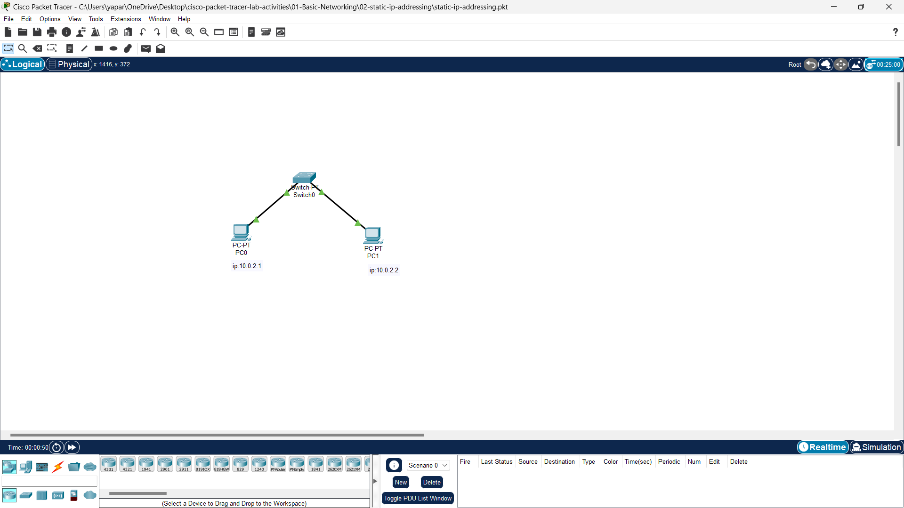

🧪 Lab 2: Static IP Addressing  
📸 Screenshot  
Below is the screenshot of the basic switch configuration setup:  

  
Static IP addressing is a method of manually assigning IP addresses to devices in a network. This lab demonstrates how to configure static IP addresses for two PCs connected via a switch and verify their connectivity using ping commands.

Path: 01-Basic-Networking/02-Static-IP.pkt  
Objective: Assign static IP addresses to end devices and verify connectivity using ping.

🛠️ Topology Overview  

| Device   | Quantity | Ports Used              |
|----------|----------|-------------------------|
| PC       | 2        | FastEthernet0           |
| Switch   | 1        | FastEthernet0/1, 0/2    |
| Cable    | 2        | Copper Straight-through |

⚙️ IP Configuration  

| Device | IP Address      | Subnet Mask      | Default Gateway |
|--------|-----------------|------------------|-----------------|
| PC0    | 10.0.2.1        | 255.255.255.0    | (optional)      |
| PC1    | 10.0.2.2        | 255.255.255.0    | (optional)      |

🪛 Step-by-Step Instructions  

1. Launch Cisco Packet Tracer and open `02-Static-IP.pkt`.  
2. Add Devices:  
   - Drag 2 PCs and 1 Switch (2960) to the workspace.  
3. Connect Devices:  
   - Use Copper Straight-through cables.  
   - PC0 → Switch Port Fa0/1  
   - PC1 → Switch Port Fa0/2  
4. Assign IP Addresses:  
   - On PC0:  
     - Go to **Desktop > IP Configuration**.  
     - Set IP: `10.0.2.1`, Subnet Mask: `255.255.255.0`.  
   - On PC1:  
     - Set IP: `10.0.2.2`, Subnet Mask: `255.255.255.0`.  

Verify using Command Prompt:  
- On PC0:  
  ```plaintext
  ping 10.0.2.2
  ```
- On PC1:  
  ping 10.0.2.1  

✅ Expected Output  
Reply from 10.0.2.1: bytes=32 time<1ms TTL=128  
If replies are received, the static IP configuration is successful.

📌 Notes  
- Ensure cables are properly connected (green link lights).  
- Subnet mask must match on both devices.  
- Default gateway is not needed unless testing inter-network routing.
