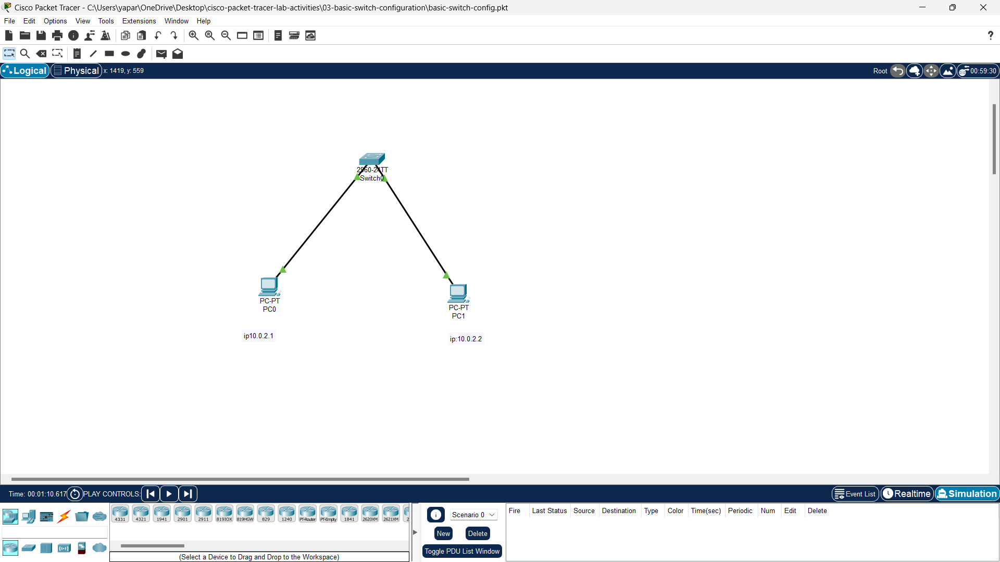

# Cisco Switch Basic Configuration Lab

This repository contains the work on configuring a Cisco switch using Cisco Packet Tracer. The configuration focuses on creating VLANs, assigning ports to VLANs, renaming the switch, and saving the configuration.

## Lab Overview

In this lab, the following configurations were performed on a Cisco switch:

1. **Renamed the switch** to `Switch1`.
2. **Created VLANs**: VLAN 10 (HR) and VLAN 20 (Finance).
3. **Assigned Ports**: Ports Fa0/1, Fa0/2 were assigned to VLAN 10, and ports Fa0/3, Fa0/4 were assigned to VLAN 20.
4. **Saved Configuration**: The running configuration was saved to ensure that the configuration is retained after a reboot.
5. **Basic Configuration Testing**: Verified VLAN assignments and port configurations.

## Files Included

- **Switch_Config.pkt**: The Cisco Packet Tracer file with the switch configuration.
- **Switch_Config_Commands.txt**: Text file with the full CLI commands used for the configuration.
- **README.md**: This file, providing an overview of the project.

## Configuration Details

In this lab, the following steps were taken:

1. **Renamed the Switch**:
   - By default, the Cisco switch name is `Switch`. To make it easier to identify, we renamed it to `Switch1`.

2. **Created VLANs** for different departments (HR and Finance):
   - VLAN 10 for HR
   - VLAN 20 for Finance

3. **Assigned Ports** to VLANs:
   - Ports Fa0/1, Fa0/2 were assigned to VLAN 10.
   - Ports Fa0/3, Fa0/4 were assigned to VLAN 20.

4. **Saved the Configuration** to ensure that the settings persist after reboot:
   - Running configuration saved to startup configuration.
     📸 **Screenshot of Setup in Cisco Packet Tracer:**



---

## Required CLI Commands

The following commands were used to configure the Cisco switch:

```plaintext
Switch> enable
Switch# configure terminal

! Rename the switch
Switch(config)# hostname Switch1

! Create VLAN 10 for HR
Switch1(config)# vlan 10
Switch1(config-vlan)# name HR
Switch1(config-vlan)# exit

! Create VLAN 20 for Finance
Switch1(config)# vlan 20
Switch1(config-vlan)# name Finance
Switch1(config-vlan)# exit

! Assign ports Fa0/1, Fa0/2 to VLAN 10
Switch1(config)# interface range fa0/1 - 2
Switch1(config-if-range)# switchport mode access
Switch1(config-if-range)# switchport access vlan 10
Switch1(config-if-range)# exit

! Assign ports Fa0/3, Fa0/4 to VLAN 20
Switch1(config)# interface range fa0/3 - 4
Switch1(config-if-range)# switchport mode access
Switch1(config-if-range)# switchport access vlan 20
Switch1(config-if-range)# exit

! Save the configuration
Switch1(config)# end
Switch1# copy running-config startup-config
```
