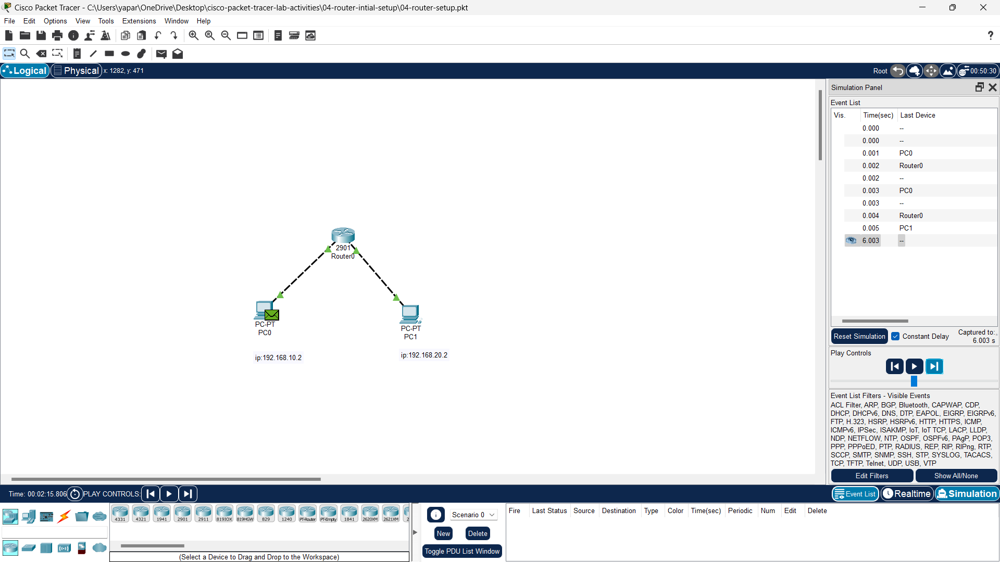

This project demonstrates how to connect **two different IP networks** using a **Cisco router**, enabling communication between two PCs in separate subnets. The configuration is done entirely through the **Graphical User Interface (GUI)** of **Cisco Packet Tracer**, with no command-line (CLI) used.

---

## 🎯 Objective

- Set up two different subnets.
- Connect both networks via a router using GUI-based configuration.
- Enable successful communication (ping/message) between the two PCs.

---

## 🧰 Devices Used

| Device | Type            |
|--------|-----------------|
| Router | Cisco 2901      |
| PC0    | 192.168.10.2     |
| PC1    | 192.168.20.2     |
| Cables | Copper Straight-Through (x2) |

---

## 🖼️ Network Topology

```

PC0 (192.168.10.2) <---> Router 2901 <---> PC1 (192.168.20.2)

````

📸 **Screenshot of Setup in Cisco Packet Tracer:**



---
---

## ⚙️ IP Configuration Details

| Device | Interface          | IP Address     | Subnet Mask       | Default Gateway  |
|--------|--------------------|----------------|--------------------|------------------|
| Router | GigabitEthernet0/0 | 192.168.1.1    | 255.255.255.0      | -                |
| Router | GigabitEthernet0/1 | 192.168.2.1    | 255.255.255.0      | -                |
| PC1    | FastEthernet0      | 192.168.1.10   | 255.255.255.0      | 192.168.1.1      |
| PC2    | FastEthernet0      | 192.168.2.10   | 255.255.255.0      | 192.168.2.1      |

---
## 🔧 Configuration Steps (GUI Only)

### 🔹 Step 1: Connect Devices
- Use **copper straight-through cables**:
  - PC0 → Router G0/0
  - PC1 → Router G0/1

### 🔹 Step 2: Configure Router Interfaces
1. Click on the router → **Config** tab.
2. Under **GigabitEthernet0/0**:
   - Turn **Port Status: On**
   - IP Address: `192.168.10.1`
   - Subnet Mask: `255.255.255.0`
3. Under **GigabitEthernet0/1**:
   - Turn **Port Status: On**
   - IP Address: `192.168.20.1`
   - Subnet Mask: `255.255.255.0`

### 🔹 Step 3: Configure PCs

#### PC0:
- IP Address: `192.168.10.2`
- Subnet Mask: `255.255.255.0`
- Default Gateway: `192.168.10.1`

#### PC1:
- IP Address: `192.168.20.2`
- Subnet Mask: `255.255.255.0`
- Default Gateway: `192.168.20.1`

---

## ✅ Testing

### Ping from PC0 to PC1:
1. Click on **PC0** → Desktop → **Command Prompt**.
2. Type:
   ```bash
   ping 192.168.20.2
````

3. If successful, the connection is working across subnets via router.

### Optional: Use **Simple PDU Tool**

* Send a test message from PC0 to PC1 using the envelope icon.

---

## 🧠 Key Takeaways

* Understand the role of routers in connecting separate subnets.
* Learn to configure basic inter-network routing using GUI only.
* Gain familiarity with subnetting, static IPs, and default gateways.

---

## 📁 Files Included

* `04-router-setup.pkt` – Cisco Packet Tracer project file
* `README.md` – Project documentation

---


## 📝 License

This project is open-source and available for learning and demonstration purposes.

```

---

Let me know if you'd like the `.md` file directly, or want to add a downloadable `.pkt` link as well!
```
