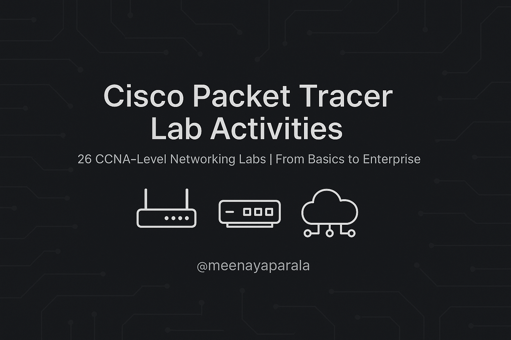

 <!-- Replace 'assets/logo.png' with the actual path to your image -->

Cisco Packet Tracer Lab Activities
I have created 26 practical lab activities using Cisco Packet Tracer. These exercises cover a wide range of networking topics, from basic to advanced, and are ideal for anyone looking to deepen their understanding of networking concepts, particularly for those preparing for CCNA certification.

📘 Activities Overview

| No. | Activity Name                  | Folder                        | Sub Folder Name                   |
|-----|--------------------------------|-------------------------------|-----------------------------------|
| 1   | PC-to-PC Communication         | 01-Basic-Networking           | 01-PC-to-PC-communication         |
| 2   | Static IP Addressing           | 01-Basic-Networking           | 02-Static-IP.pkt                  |
| 3   | Basic Switch Configuration     | 01-Basic-Networking           | 03-Switch-Config.pkt              |
| 4   | Router Initial Setup           | 01-Basic-Networking           | 04-Router-Setup.pkt               |
| 5   | Subnetting and Network Design  | 01-Basic-Networking           | 05-Subnetting.pkt                 |
| 6   | Static Routing (2 Routers)     | 02-Routing                    | 06-Static-Routing-2Routers.pkt    |
| 7   | Static Routing (3 Routers)     | 02-Routing                    | 07-Static-Routing-3Routers.pkt    |
| 8   | RIP Routing Protocol           | 02-Routing                    | 08-RIP.pkt                        |
| 9   | OSPF Single Area               | 02-Routing                    | 09-OSPF.pkt                       |
| 10  | EIGRP Basic Configuration      | 02-Routing                    | 10-EIGRP.pkt                      |
| 11  | VLAN Creation                  | 03-Switching-and-VLANs        | 11-VLAN-Creation.pkt              |
| 12  | Inter-VLAN Routing             | 03-Switching-and-VLANs        | 12-InterVLAN-Routing.pkt          |
| 13  | Trunk Link Between Switches    | 03-Switching-and-VLANs        | 13-Trunking.pkt                   |
| 14  | VTP Configuration              | 03-Switching-and-VLANs        | 14-VTP.pkt                        |
| 15  | Standard ACL                   | 04-Access-Control-and-Security| 15-Standard-ACL.pkt               |
| 16  | Extended ACL                   | 04-Access-Control-and-Security| 16-Extended-ACL.pkt               |
| 17  | Port Security on Switch        | 04-Access-Control-and-Security| 17-Port-Security.pkt              |
| 18  | DHCP Server                    | 05-Network-Services           | 18-DHCP.pkt                       |
| 19  | DNS Server                     | 05-Network-Services           | 19-DNS.pkt                        |
| 20  | Web Server                     | 05-Network-Services           | 20-Web-Server.pkt                 |
| 21  | Email Server                   | 05-Network-Services           | 21-Email-Server.pkt               |
| 22  | Static NAT                     | 06-NAT-and-WAN                | 22-Static-NAT.pkt                 |
| 23  | PAT (Port Address Translation) | 06-NAT-and-WAN                | 23-PAT.pkt                        |
| 24  | PPP Configuration              | 06-NAT-and-WAN                | 24-PPP.pkt                        |
| 25  | Small Enterprise Network       | 07-Project-Level              | 25-Small-Enterprise-Network.pkt   |
| 26  | Secure Wireless Network        | 07-Project-Level              | 26-Secure-Wireless-Network.pkt    |

📁 How to Use
Open each .pkt file in Cisco Packet Tracer.

Review the topology and configuration in the workspace.

Test connectivity using the Simulation tab.

Optional: Check the assets/screenshots/ folder for topology previews.

Modify and experiment to deepen understanding and gain hands-on experience.

